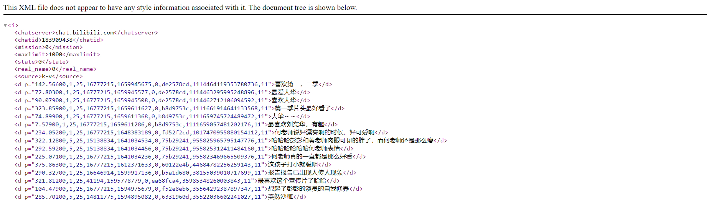

# B站爬虫

## B站API

### 各种ID[1](#refer-anchor-1)

* **aid**：视频av号，如：https://www.bilibili.com/video/av93987817，其中av后面的数字即视频的**av号**，**av号**与**bv号**一一对应；
* **media_id**：番剧md号，如：https://www.bilibili.com/bangumi/media/md28229233，其中md后面的数字即番剧的md号；
* **season_id**：番剧ss号，如：https://www.bilibili.com/bangumi/play/ss33802，其中ss后面的数字即番剧的**ss号**；
* ep：番剧视频id号，如：https://www.bilibili.com/bangumi/play/ep330798，其中ep后面的数字即番剧的单集编号；
* **cid**：番剧视频弹幕池id号；
* **bvid**：视频bv号，如https://www.bilibili.com/video/BV1WB4y167DB，其中**BV**后面即视频**bv号**，番剧、视频合集中的视频共用一个**bvid**；

### 常用ID查询

#### 通过bvid和aid转换[2](#refer-anchor-2)

~~~
https://api.bilibili.com/x/web-interface/archive/stat?bvid=
~~~

在**bvid**后输入**BV号即可**，例如：https://api.bilibili.com/x/web-interface/archive/stat?bvid=BV1Jt411B7M5，获取的数据如下：

~~~json
{
    "code":0,
    "message":"0",
    "ttl":1,
    "data":{
        "aid":39596505,
        "bvid":"BV1Jt411B7M5",
        "view":1648,
        "danmaku":1,
        "reply":3,
        "favorite":58,
        "coin":14,
        "share":10,
        "like":22,
        "now_rank":0,
        "his_rank":0,
        "no_reprint":1,
        "copyright":1,
        "argue_msg":"",
        "evaluation":""
    }
}
~~~

也可以通过算法转换[3](#refer-anchor-3)：

~~~python
def b2a(bv):
	""" BV -> av """
	if bv[:2] == 'av':
		return bv[2:]
	bv = list(bv[2:])
	keys = {'1': 13, '2': 12, '3': 46, '4': 31, '5': 43, '6': 18, '7': 40, '8': 28, '9': 5,
			'A': 54, 'B': 20, 'C': 15, 'D': 8, 'E': 39, 'F': 57, 'G': 45, 'H': 36, 'J': 38, 'K': 51, 'L': 42, 'M': 49, 'N': 52, 'P': 53, 'Q': 7, 'R': 4, 'S': 9, 'T': 50, 'U': 10, 'V': 44, 'W': 34, 'X': 6, 'Y': 25, 'Z': 1,
			'a': 26, 'b': 29, 'c': 56, 'd': 3, 'e': 24, 'f': 0, 'g': 47, 'h': 27, 'i': 22, 'j': 41, 'k': 16, 'm': 11, 'n': 37, 'o': 2, 'p': 35, 'q': 21, 'r': 17, 's': 33, 't': 30, 'u': 48, 'v': 23, 'w': 55, 'x': 32, 'y': 14, 'z': 19}
	for i in range(len(bv)):
		bv[i] = keys[bv[i]]
	bv[0] *= (58 ** 6)
	bv[1] *= (58 ** 2)
	bv[2] *= (58 ** 4)
	bv[3] *= (58 ** 8)
	bv[4] *= (58 ** 5)
	bv[5] *= (58 ** 9)
	bv[6] *= (58 ** 3)
	bv[7] *= (58 ** 7)
	bv[8] *= 58
	return str((sum(bv) - 100618342136696320) ^ 177451812)
~~~

#### 通过bvid查询cid[2](#refer-anchor-2)

~~~
https://api.bilibili.com/x/player/pagelist?bvid=
~~~

在**bvid**后输入**BV号即可**，例如：https://api.bilibili.com/x/player/pagelist?bvid=BV1kK4y1Y7Zq，获取的数据如下：

~~~json
{
    "code":0,
    "message":"0",
    "ttl":1,
    "data":
    [{
        "cid":227684649,
        "page":1,
        "from":"vupload",
        "part":"8.12天文社上山观测",
        "duration":225,
        "vid":"",
        "weblink":"",
        "dimension":
        {
            "width":3840,
            "height":2160,
            "rotate":0
        }
    }]
}
~~~

#### 通过media_id号查询season_id号[4](#refer-anchor-4)

~~~
https://api.bilibili.com/pgc/review/user?media_id=
~~~

在**media_id**后输入**media_id号即可**，例如：https://api.bilibili.com/pgc/review/user?media_id=28236818，获取的数据如下：

~~~ json
{
    "code":0,
    "message":"success",
    "result":{
        "media":{
            "areas":[{
                "id":3,
                "name":"美国"
            }],
            "cover":"http://i0.hdslb.com/bfs/bangumi/image/3de37f6af73fb4006694e1d7865313ecc089239a.png", 
            "horizontal_picture":"http://i0.hdslb.com/bfs/bangumi/image/76e1a1aa2dcd4a1c0c4619361344b814c9e56cfe.png",
            "media_id":28236818,
            "new_ep":{
                "id":512904,
                "index":"24",
                "index_show":"全24集"
          },
            "season_id":41112,
            "share_url":"https://www.bilibili.com/bangumi/media/md28236818",
            "title":"老友记  第八季",
            "type":5,
            "type_name":"电视剧"
        }
    }
}
~~~

#### 通过season_id查询aid号[4](#refer-anchor-4)

~~~
https://api.bilibili.com/pgc/web/season/section?season_id=
~~~

在**season_id**后输入**season_id号即可**，例如：https://api.bilibili.com/pgc/web/season/section?season_id=41112，获取的数据如下：

~~~json
{
    "code":0,
    "message":"success",
    "result":{
        "main_section":{
            "episodes":[{
                "aid":509894554,
                "badge":"",
                "badge_info":{
                    "bg_color":"#FB7299",
                    "bg_color_night":"#BB5B76",
                    "text":""
                },
                "badge_type":0,
                "cid":552937252,
                "cover":"http://i0.hdslb.com/bfs/archive/c6f01ede3b59a30e0de36a079f33dd6b7c78bd3c.png",
                "from":"bangumi",
                "id":512881,
                "is_premiere":0,
                "long_title":"在说了“我愿意”之后",
                "share_url":"https://www.bilibili.com/bangumi/play/ep512881",
                "status":2,
                "title":"1",
                "vid":""
            },{
                "aid":679897100,
                "badge":"会员",
                "badge_info":{
                    "bg_color":"#FB7299",
                    "bg_color_night":"#BB5B76",
                    "text":"会员"
                },
                "badge_type":0,
                "cid":552937769,
                "cover":"http://i0.hdslb.com/bfs/archive/6bf395df18f3bf13a171e19bcb49c1c33933538d.png",
                "from":"bangumi",
                "id":512882,
                "is_premiere":0,
                "long_title":"红毛线衫",
                "share_url":"https://www.bilibili.com/bangumi/play/ep512882",
                "status":13,
                "title":"2",
                "vid":""
            },{
                "aid":339900188,
                "badge":"会员",
                "badge_info":{
                    "bg_color":"#FB7299",
                    "bg_color_night":"#BB5B76",
                    "text":"会员"
                },
                "badge_type":0,
                "cid":552938339,
                "cover":"http://i0.hdslb.com/bfs/archive/80599b22666868ef95b13351a3f62a55007cfceb.png",
                "from":"bangumi",
                "id":512883,
                "is_premiere":0,"long_title":"瑞秋告诉了罗斯",
                "share_url":"https://www.bilibili.com/bangumi/play/ep512883",
                "status":13,
                "title":"3",
                "vid":""
            }]
        }
    }
~~~

### 弹幕API
用户可以使用`https://comment.bilibili.com/183909438.xml` 或者 `https://api.bilibili.com/x/v1/dm/list.so?oid=183909438` 来获取弹幕数据，其中**183909438**为视频的**cid**号，获取结果如下：

弹幕**解析规则**[3](#refer-anchor-3)如下：

`<d p="142.56600,1,25,16777215,1659945675,0,de2578cd,1114464119353780736,11">喜欢第一，二季</d>`，其中**p**中数据解析如下：

* 第一个参数：弹幕出现的时间【以秒为单位】； 
* 第二个参数：弹幕的模式【1..3滚动弹幕；4底端弹幕；5顶端弹幕；6逆向弹幕；7精准定位；8高级弹幕】；
* 第三个参数：字号【12非常小，16特小，18小，25中，36大，45很大，64特别大 】；
* 第四个参数：字体的颜色以HTML颜色的十进制为准 ；
* 第五个参数：Unix格式的时间戳，基准时间为 1970-1-1 08:00:00；
* 第六个参数：弹幕池【0普通池，1字幕池，2特殊池】； 
* 第七个参数：发送者的ID；
* 第八个参数：弹幕在弹幕数据库中的**rowID**； 
* 第九个参数：未知；

[1] [【小教程】B站参数及API介绍_Magical-E的博客-CSDN博客_b站api](https://blog.csdn.net/qq_44275286/article/details/109256436)

[2] [B站视频CID & 弹幕文件获取 - 哔哩哔哩 (bilibili.com)](https://www.bilibili.com/read/cv7923601)

[3] [python爬虫获取B站视频评论_mlyde的博客-CSDN博客_爬取b站评论](https://blog.csdn.net/mlyde/article/details/118936871)

[4] [【小教程】B站参数及API介绍_Magical-E的博客-CSDN博客_b站api](https://blog.csdn.net/qq_44275286/article/details/109256436)

