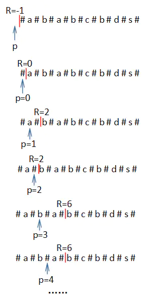
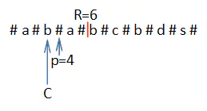

# Manacher算法

### 简介

**Manacher**算法是用来查找一个**字符串**中的**最长回文子串**的线性算法$\Theta(n)$。

### 算法

***

#### 预处理

在输入字符的**首、尾**以及**每个字符之间**插入一个**任意**特定字符。

例如：

**原字符串**为

~~~
acbbbggg
~~~

**预处理**后的字符串为

~~~
#a#c#b#b#b#g#g#g#
~~~

#### 算法概念

* **回文半径数组**：$radius$

  记录每个位置的字符为**回文中心**求出的**回文半径长度**。

  例如：

  ~~~
  #a#c#b#b#b#g#g#g#
  [1, 2, 1, 2, 1, 2, 3, 4, 3, 2, 1, 2, 3, 4, 3, 2, 1]
  ~~~

* **最右回文右边界**：$R$

  这个位置及之前的位置的回文子串，所到达的最右边的地方。

  例如：

  

* **最右回文右边界的对称中心**：$C$

  就是上面的**最右回文右边界**的中心点。

  例如：

  

#### 算法流程

~~~
第一种情况：下一个要移动的位置在*最右回文右边界*的右边：

	将移动的位置设为*对称中心*，向两边搜索，并更新radius, R, C

第二种情况：下一个要移动的位置就是R或者在R的左边：
	(P'是P以C为*对称中心*的*对称点*)
	(PL是以P'为*对称中心*的*回文子串*的*左边界*)
	(CL是以C为*对称中心*的*回文子串*的*左边界*)
	
	1、下一个要移动的位置P不在R右边，且CL < PL:
		P'的回文半径就是P的回文半径 radius[P] = radius[P']
		
	2、下一个要移动的位置P不在R右边，且CL > PL:
		P的回文半径就是P到R的距离 radius[P] = R - P + 1
	
	3、下一个要移动的位置P不在R右边，且CL = PL:
		P的回文半径需要继续查找下一个位置(R的下一个位置)
~~~

#### 代码

[Manacher代码](.\Manacher.py)